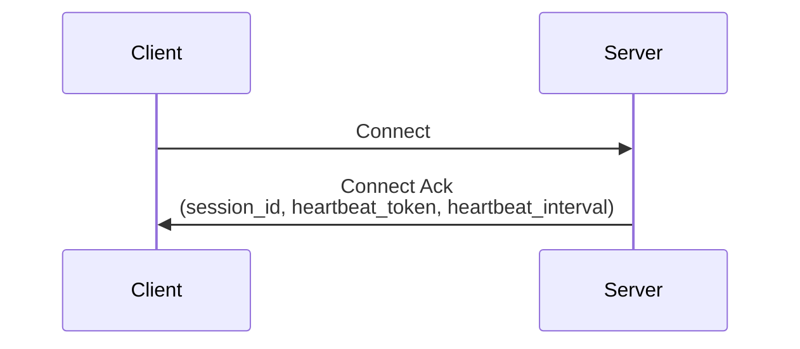
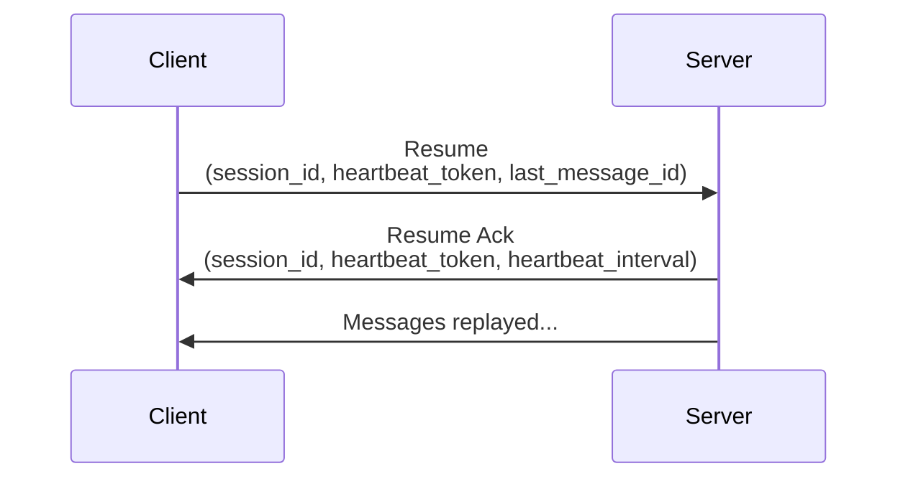
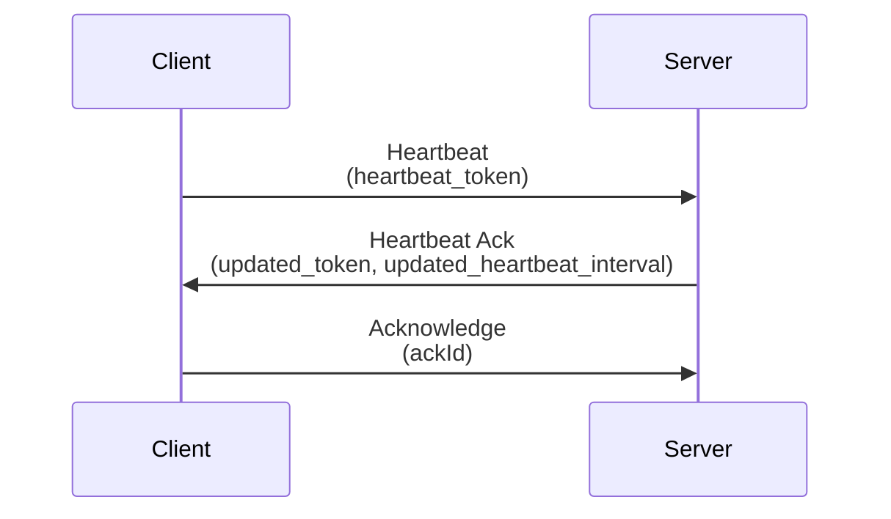
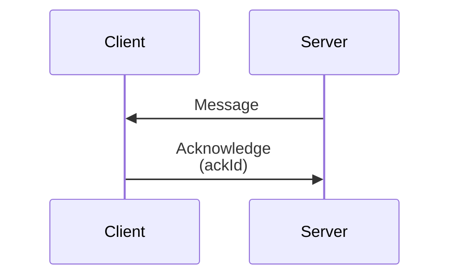
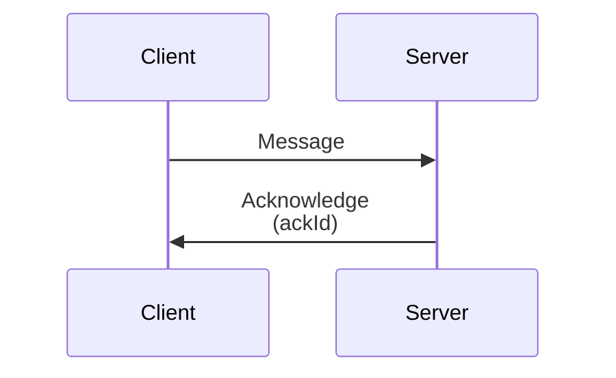

# Spark WS Lifecycle

## Overview

The lifecycle of a Spark Websocket connection is as follows:

### Connection

1. **Connection**: The client connects to the server using the standard Websocket handshake.
2. **Authentication**: The client sends a `ws:connect` message to the server to start the connection process and authenticate itself (if required).
3. **Connection Acknowledgement**: The server sends a `ws:connect_ack` message to the client to acknowledge the connection and send the gateway information.

### Resuming

1. **Resuming**: The client sends a `ws:resume` message to the server to resume the connection using the `session_id`, `heartbeat_token` and `last_message_id` from the previous connection.
2. **Resuming Acknowledgement**: The server sends a `ws:resume_ack` message to the client to acknowledge the resuming process and send updated information about the client.

> [!IMPORTANT]
> The `last_message_id` is the ID of the last message that was received by the client before the connection was closed.

> [!NOTE]
> If exists, the server will replay any missed messages that were sent after the last message ID.

### Heartbeat

1. **Heartbeat**: The client sends a `ws:heartbeat` message to the server to keep the connection alive using a token that was sent in the `ws:connect_ack` message.
2. **Heartbeat Acknowledgement**: The server sends a `ws:heartbeat_ack` message to the client to acknowledge the heartbeat and send updated information about the client (if required).
3. **Acknowledge**: The client sends a `ws:ack` message to the server to acknowledge the `ws:heartbeat_ack` message, this is only required if the `updated_token` or `updated_heartbeat_interval` fields are present.

### On Server Message

1. **Server Message**: The server sends a message to the client.
2. **Acknowledge**: The client sends a `ws:ack` message to the server to acknowledge the message.

### On Client Message

1. **Client Message**: The client sends a message to the server.
2. **Acknowledge**: The server sends a `ws:ack` message to the client to acknowledge the message.

